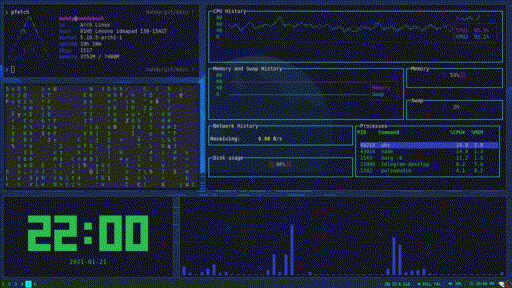
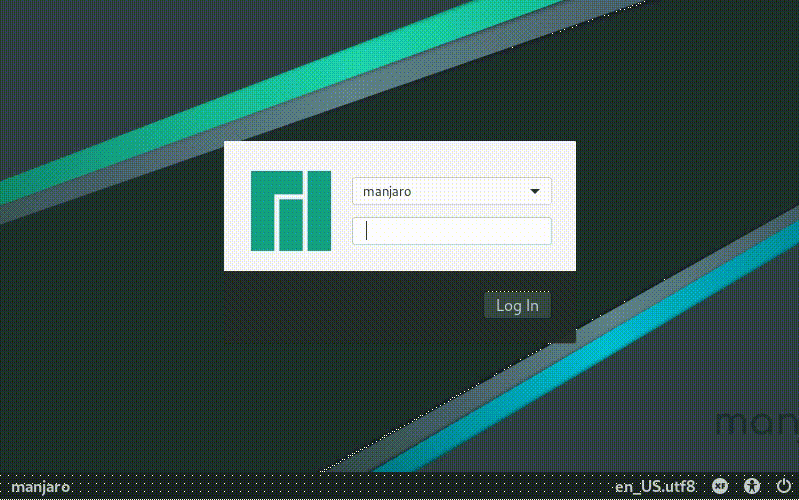
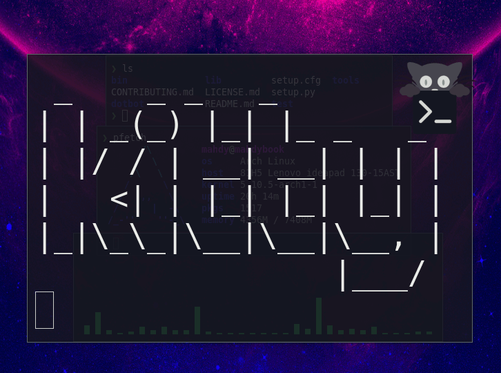
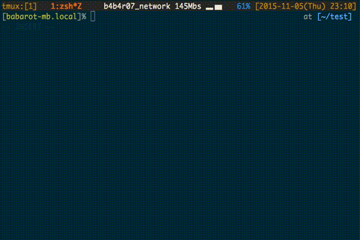

# dotfiles

These files are optimized for me (as a desktop user), if you did enjoy, help me improve this repository by pull requests or maybe [donating](#donate).

## Details

| Name                  | Value                         |
| --------------------- | ----------------------------- |
| Graphical Server      | [Xorg](#xorg)                 |
| Desktop Environment   | *None*                        |
| Window Manager        | [i3](#i3)                     |
| Display Manager       | [LightDM](#lightdm)           |
| Terminal              | [Kitty](#kitty)               |
| Shell                 | [ZSH](#zsh)                   |
| File Manager          | [Thunar](#thunar)             |
| Internet Browser      | [QuteBrowser](#qute-browser)  |

## Xorg

[Xorg](https://x.org) is the most popular display server.

**Installation**

`pacman -S xorg`

## i3

[i3](https://i3wm.org) is a tiling window manager and I use it as my daily WM.

**Installation**

`pacman -S i3-wm`

**Configuration**

`./config/i3/install`

## LightDM

[LightDM](https://github.com/canonical/lightdm) is a cross-desktop display manager.

I use *lightdm-gtk-greeter* as my greeter.

**Installation**

`pacman -S lightdm lightdm-gtk-greeter`

**Configuration**

`sed -i 's/greeter-session=/greeter-session=lightdm-gtk-greeter/g' /etc/lightdm/lightdm.conf`

## Kitty

[kitty](https://sw.kovidgoyal.net/kitty) - the fast, featureful, GPU based terminal emulator

**Installation**

`pacman -S kitty`

**Configuration**

`./config/kitty/install`

## ZSH

[Zsh](https://www.zsh.org) is a shell designed for interactive use, although it is also a powerful scripting language.

**Installation**

`pacman -S zsh`

**Configuration**

Change your default shell:

`chsh -s /bin/zsh`

I use oh-my-zsh as well: *(No Configuration On Oh-My-Zsh)*

`sh -c "$(curl -fsSL https://raw.githubusercontent.com/ohmyzsh/ohmyzsh/master/tools/install.sh)"`

## Thunar

[Thunar](https://docs.xfce.org/xfce/thunar/start) is a modern file manager for the Xfce Desktop Environment.

**Installation**

`pacman -S thunar`

## Qute Browser

[Qute Browser](https://qutebrowser.org) is a Vim-style Web Browser.

**Installation**

`pacman -S qutebrowser`

**Configuration**

`./config/qutebrowser/install`

## Donate

Made with <3 by **Mahdy Mirzade**

I put some time on this project and I really don't think it has any values but I would love some cryptocurrencies:
- BTC: 1H5YUVVif9u9JNBVaboCwsBvHAoDeAW5yc
- ETH: 0x05A11A118eb3BDbD015c2fdd3F843dBe422C2955
- LTC: LiZRqXUrQYjs8TapBEpEngiSiZMvViaPhi
- ZEC: t1NRoc1a6nXxZT1c1dDCUaMTGGRcpfCBcXy

Yell at me: [me@mahdy.fun](mailto:me@mahdy.fun)
