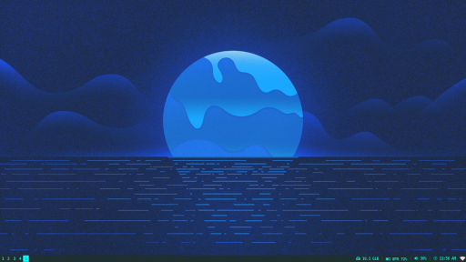
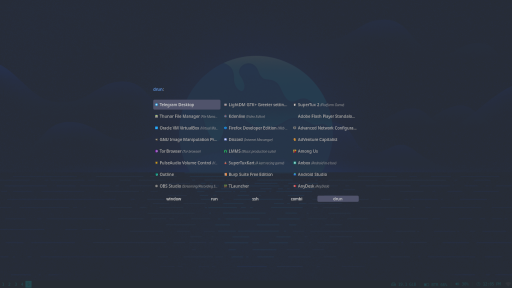
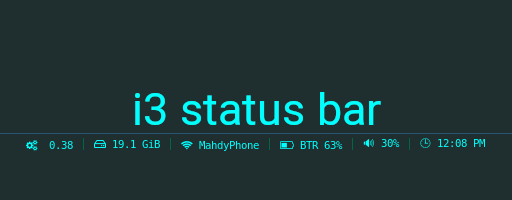

# i3

## ScreenShots

> Clean Interview without any opened windows. *[only i3status & nm-applet]*

> Launching apps with rofi

> Using [i3status](https://github.com/mahdymirzade/dotfiles/tree/main/config/i3status) as your panel

## CheatSheet

| Key                       | Functionality                                 |
| ------------------------- | --------------------------------------------- |
| Super                     | The Main Controller                           |
| Super + Enter             | Run Terminal                                  |
| Super + Shift + Q         | Close Windows                                 |
| Super + Z                 | Simple Launcher                               |
| Super + Shift + Z         | Rofi Launcher                                 |
| Super + *j/k/l/,*         | Change Focus                                  |
| Super + Arrows            | Change Focus (Curser Keys)                    |
| Super + Shift + *j/k/l/,* | Move Focused Window                           |
| Super + Shift + Arrows    | Move Focused Window (Curser Keys)             |
| Super + F                 | Full Screen the Focused Window                |
| Super + R                 | Enter the Resize Mode                         |
| Super + *H/V*             | Change Split Direction (horizontal/vertical)  |
| Super + Shift + A         | Show Window on Active Workspace               |
| Super + Shift + Space     | Toggle Floating/Tiling Mode on a Window       |
| Super + Space             | Change Focus between Floating/Tiling windows  |
| Super + 1-9               | Switch to Workspace 1-9                       |
| Super + Shift + 1-9       | Move Focused Window to Workspace 1-9          |
| Super + Shift + R         | Restart i3 Window Manager                     |
| Super + Shift + E         | Exit i3 Window Manager                        |

> Window Management Keybinds

| Key               | Functionality                         |
| ----------------- | ------------------------------------- |
| PrtSc             | Capturing Screen Shot *Using scrot*   |
| Super + PrtSc     | Capturing Focused Window's Screen     |

> Custom Keybinds
