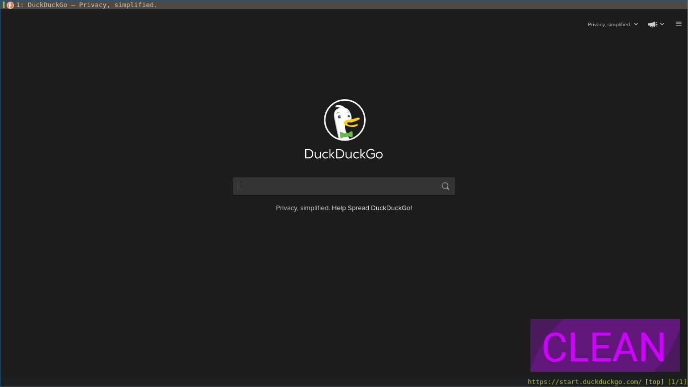
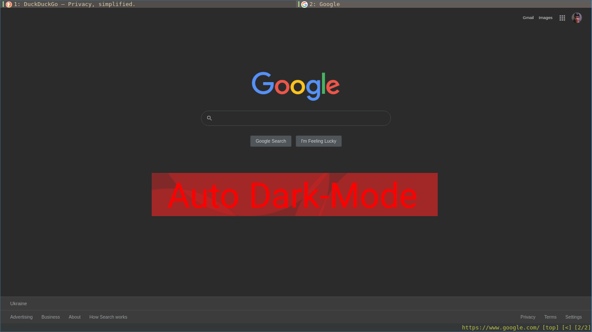
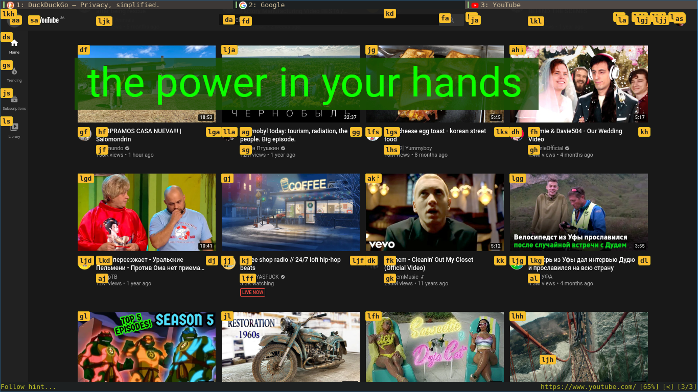

# Qutebrowser Docs
[Qute Browser](https://qutebrowser.org/) is a Vim-style Web Browser.<br/>
[Main Documentation](https://qutebrowser.org/doc/help/configuring.html)


## Headers
- [Install + Config](#installation)
- [QuteBrowser ScreenShots](#screenshots)
- [QuteBrowser CheatSheet](#cheatsheet)
- [.config/qutebrowser/config.py](#configqutebrowserconfigpy)


## Installation
```
$ pacman -S qutebrowser
$ git clone https://github.com/mahdymirzade/dotfiles.git && cd dotfiles
$ ./config/qutebrowser/install
```


## ScreenShots
> Qute Browser is clean, fast and AWESOME!


> Doing Dark Mode Everywhere :D


> Power in your hands with awesome keyboard shortcuts



## CheatSheet
> Basic keybindings

| Key         | Functionality               |
| ----------- | --------------------------- |
| :           | Enter command line          |
| /           | Search (n: forth, N: back)  |
| Arrows/hjkl | Move around a webpage       |
| O           | Open URL / Search           |
| GO          | Edit Current URL            |
| D           | Close current tab           |
| U           | Restore the closed tab      |
| L           | Next history record (forth) |
| H           | Prev history record (back)  |
| F           | Click on sth without mouse  |
| Shift + O   | Open URL in a new tab       |
| Shift + J   | Next Tab                    |
| Shift + K   | Prev Tab                    |
| Alt + 1-9   | Switch between tabs 1-9     |

Original help page and [training course](https://www.shortcutfoo.com/app/dojos/qutebrowser) are your best friends.<br/>
You can get to qutebrowser's help page by ':help'.


## .config/qutebrowser/config.py
**Load Autoconfig + Dark reader + Auto Save + 75% Zoom + Open Url's in MPV**:
```
config.load_autoconfig()
config.set("colors.webpage.darkmode.enabled", True)
config.set("auto_save.session", True)
config.set("zoom.default", "75%")
config.bind('B', 'hint links spawn mpv {hint-url}')
```
**Basic Colors**:
```
base00 = "#1d2021"
base01 = "#3c3836"
base02 = "#504945"
base03 = "#665c54"
base04 = "#bdae93"
base05 = "#d5c4a1"
base06 = "#ebdbb2"
base07 = "#fbf1c7"
base08 = "#fb4934"
base09 = "#fe8019"
base0A = "#fabd2f"
base0B = "#b8bb26"
base0C = "#8ec07c"
base0D = "#83a598"
base0E = "#d3869b"
base0F = "#d65d0e"
```
**Set Colors**:
```
c.colors.completion.fg = base05
c.colors.completion.odd.bg = base01
c.colors.completion.even.bg = base00
c.colors.completion.category.fg = base0A
c.colors.completion.category.bg = base00
c.colors.completion.category.border.top = base00
c.colors.completion.category.border.bottom = base00
c.colors.completion.item.selected.fg = base05
c.colors.completion.item.selected.bg = base02
c.colors.completion.item.selected.border.top = base02
c.colors.completion.item.selected.border.bottom = base02
c.colors.completion.item.selected.match.fg = base0B
c.colors.completion.match.fg = base0B
c.colors.completion.scrollbar.fg = base05
c.colors.completion.scrollbar.bg = base00
c.colors.contextmenu.disabled.bg = base01
c.colors.contextmenu.disabled.fg = base04
c.colors.contextmenu.menu.bg = base00
c.colors.contextmenu.menu.fg =  base05
c.colors.contextmenu.selected.bg = base02
c.colors.contextmenu.selected.fg = base05
c.colors.downloads.bar.bg = base00
c.colors.downloads.start.fg = base00
c.colors.downloads.start.bg = base0D
c.colors.downloads.stop.fg = base00
c.colors.downloads.stop.bg = base0C
c.colors.downloads.error.fg = base08
c.colors.hints.fg = base00
c.colors.hints.bg = base0A
c.colors.hints.match.fg = base05
c.colors.keyhint.fg = base05
c.colors.keyhint.suffix.fg = base05
c.colors.keyhint.bg = base00
c.colors.messages.error.fg = base00
c.colors.messages.error.bg = base08
c.colors.messages.error.border = base08
c.colors.messages.warning.fg = base00
c.colors.messages.warning.bg = base0E
c.colors.messages.warning.border = base0E
c.colors.messages.info.fg = base05
c.colors.messages.info.bg = base00
c.colors.messages.info.border = base00
c.colors.prompts.fg = base05
c.colors.prompts.border = base00
c.colors.prompts.bg = base00
c.colors.prompts.selected.bg = base02
c.colors.statusbar.normal.fg = base0B
c.colors.statusbar.normal.bg = base00
c.colors.statusbar.insert.fg = base00
c.colors.statusbar.insert.bg = base0D
c.colors.statusbar.passthrough.fg = base00
c.colors.statusbar.passthrough.bg = base0C
c.colors.statusbar.private.fg = base00
c.colors.statusbar.private.bg = base01
c.colors.statusbar.command.fg = base05
c.colors.statusbar.command.bg = base00
c.colors.statusbar.command.private.fg = base05
c.colors.statusbar.command.private.bg = base00
c.colors.statusbar.caret.fg = base00
c.colors.statusbar.caret.bg = base0E
c.colors.statusbar.caret.selection.fg = base00
c.colors.statusbar.caret.selection.bg = base0D
c.colors.statusbar.progress.bg = base0D
c.colors.statusbar.url.fg = base05
c.colors.statusbar.url.error.fg = base08
c.colors.statusbar.url.hover.fg = base05
c.colors.statusbar.url.success.http.fg = base0C
c.colors.statusbar.url.success.https.fg = base0B
c.colors.statusbar.url.warn.fg = base0E
c.colors.tabs.bar.bg = base00
c.colors.tabs.indicator.start = base0D
c.colors.tabs.indicator.stop = base0C
c.colors.tabs.indicator.error = base08
c.colors.tabs.odd.fg = base05
c.colors.tabs.odd.bg = base01
c.colors.tabs.even.fg = base05
c.colors.tabs.even.bg = base00
c.colors.tabs.pinned.even.bg = base0C
c.colors.tabs.pinned.even.fg = base07
c.colors.tabs.pinned.odd.bg = base0B
c.colors.tabs.pinned.odd.fg = base07
c.colors.tabs.pinned.selected.even.bg = base02
c.colors.tabs.pinned.selected.even.fg = base05
c.colors.tabs.pinned.selected.odd.bg = base02
c.colors.tabs.pinned.selected.odd.fg = base05
c.colors.tabs.selected.odd.fg = base05
c.colors.tabs.selected.odd.bg = base02
c.colors.tabs.selected.even.fg = base05
c.colors.tabs.selected.even.bg = base02
# c.colors.webpage.bg = base00
```
**Credits for color pallet:** [base16-qutebrowser](https://github.com/theova/base16-qutebrowser)

**Short Links**
- [Main Menu](./../../../../)
- [Back to Config Dir](./../)
